# Diagramas Mermaid — Bray Controls Andina

## 1. Mapa General de Arquitectura Empresarial

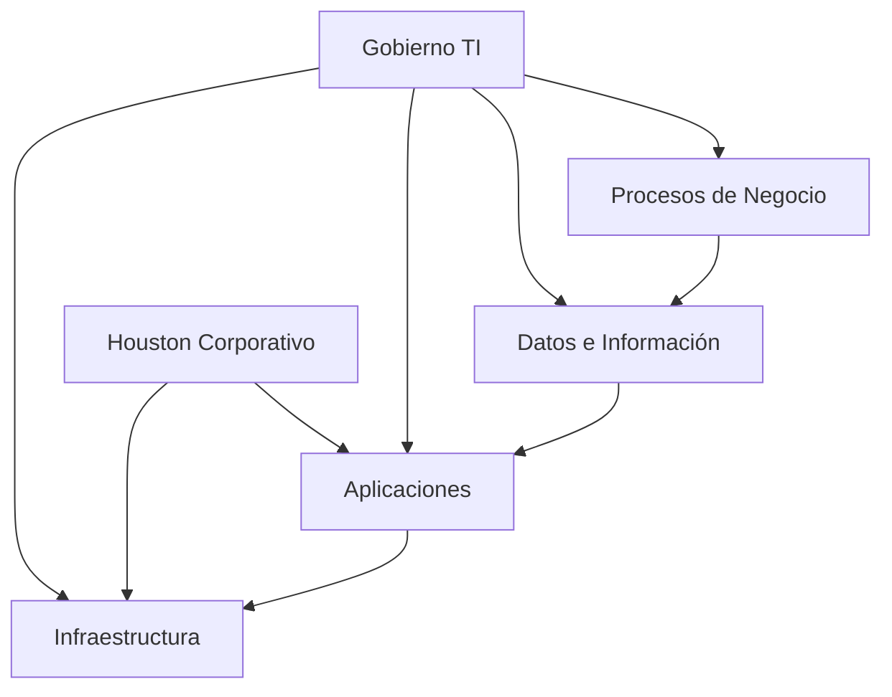

## 2. Arquitectura AS-IS

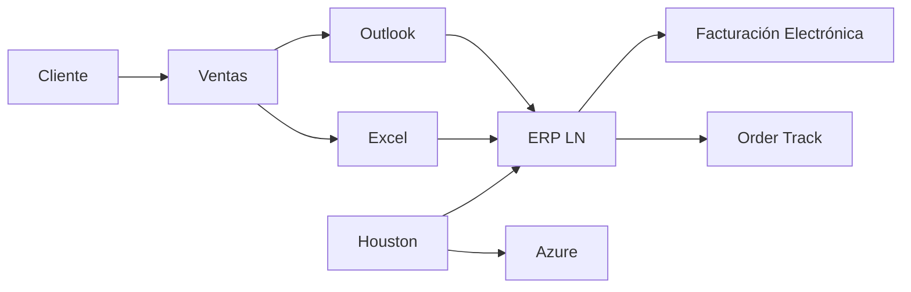

## 3. Arquitectura TO-BE


```mermaid
flowchart LR
    Cliente --> Dynamics[Dynamics 365]
    Dynamics --> LN[ERP LN]

    LN --> Facturacion[Facturación Electrónica]
    LN --> OrderTrack[Order Track]
    LN --> PowerBI[Power BI]

    MFA[MFA]
    SLA[SLA Houston]
    Gov[Gobierno TI]

    Gov --> LN
    Gov --> MFA
    Houston --> LN

---

## 4. BPMN AS-IS

```mermaid
flowchart TD
    A[Cliente solicita cotización]
    B[Ventas externas]
    C[Ventas internas]
    D[Correo Outlook]
    E[Excel Reorder Point]
    F[ERP LN]
    G[Bodega]
    H[Facturación]

    A --> B
    B --> C
    C --> D
    D --> E
    E --> F
    F --> G
    G --> H
```

## 5. BPMN TO-BE

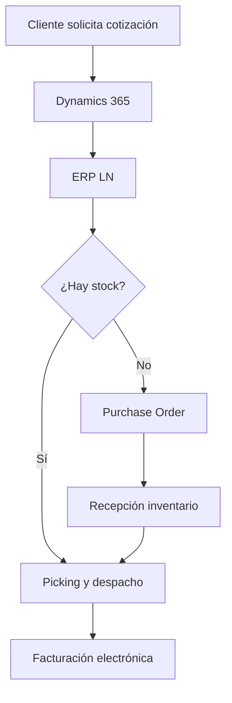

## 6. ERD Simplificado

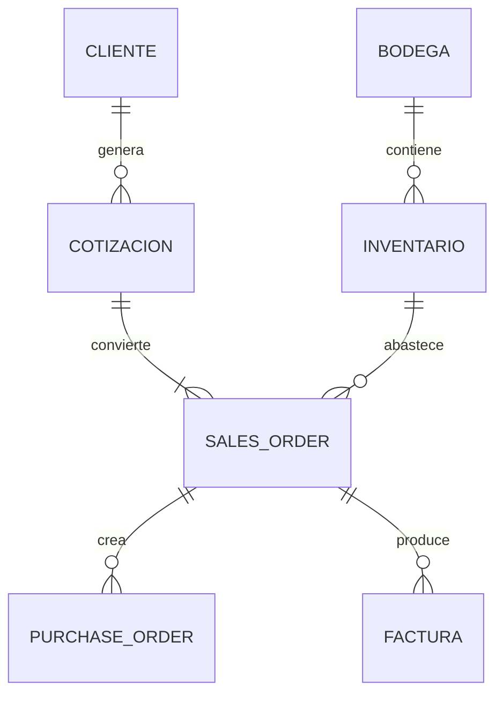

## 7. Flujo de Datos

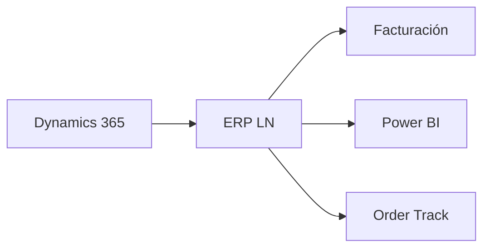

## 8. Diagrama de Integraciones

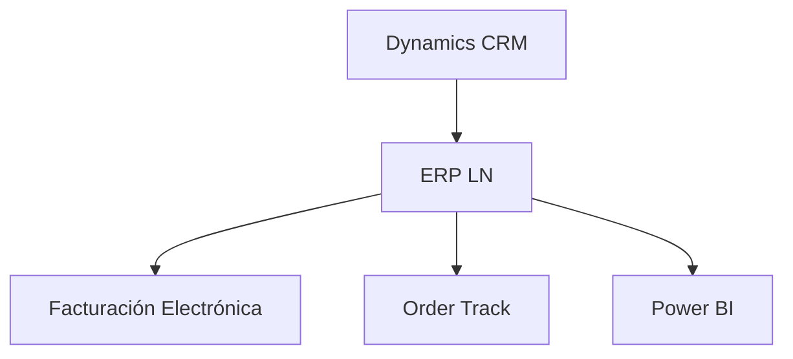

## 9. Infraestructura Tecnológica

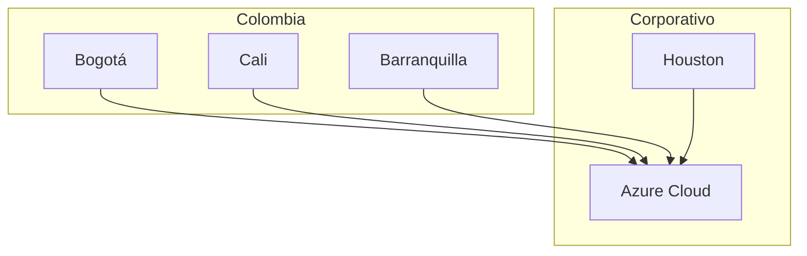

## 10. Gobierno TI

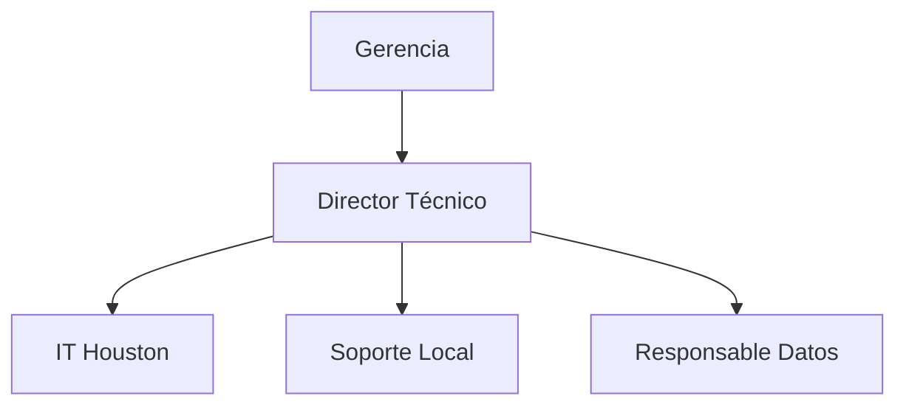

## 11. Gestión de Incidentes

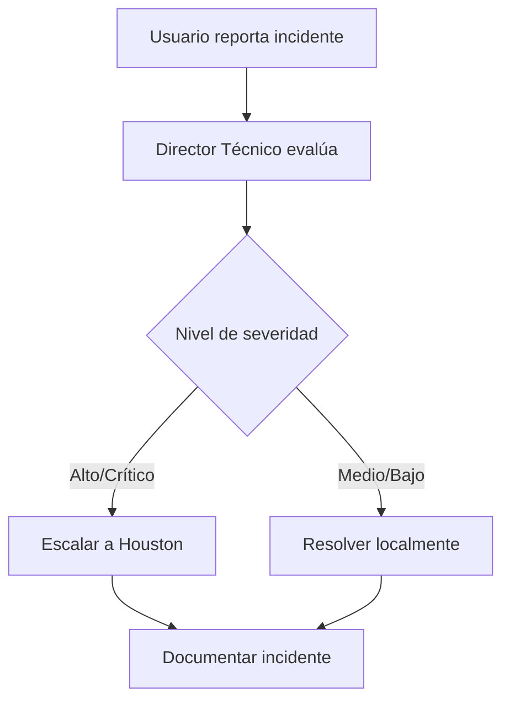

## 12. Matriz STRIDE

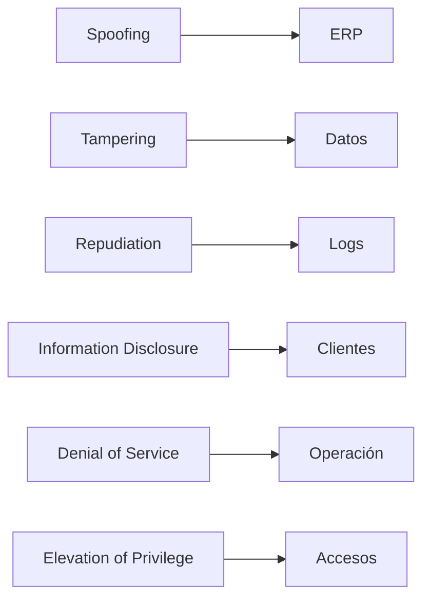

## 13. Roadmap de Transformación

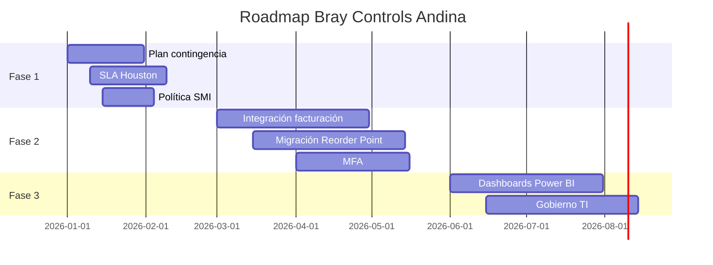

## 14. Heatmap de Riesgos

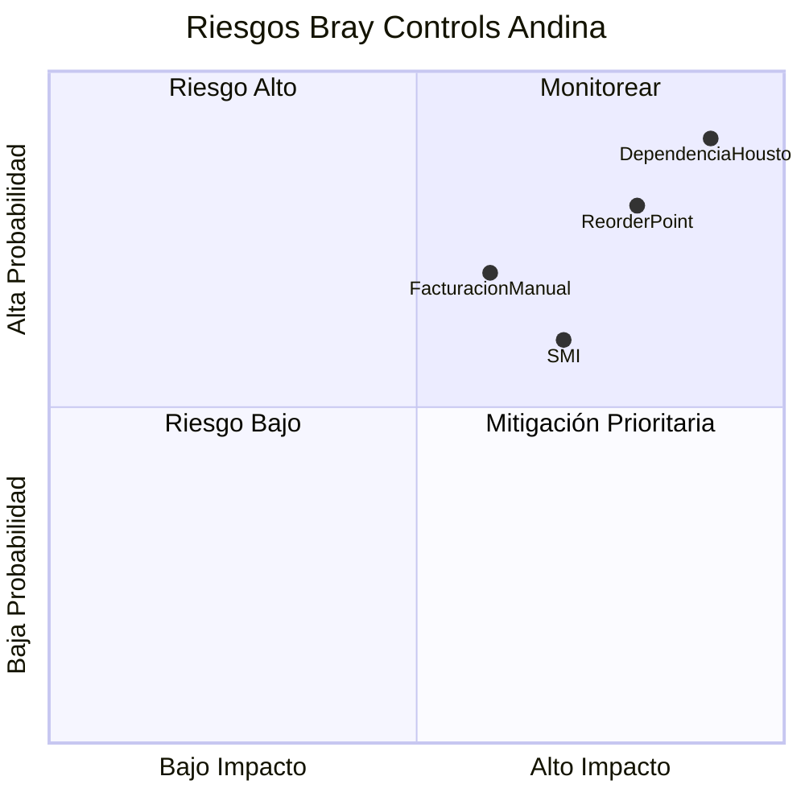

## 15. Dependencias Críticas

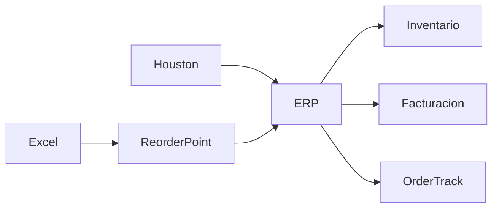

## 16. Single Source of Truth

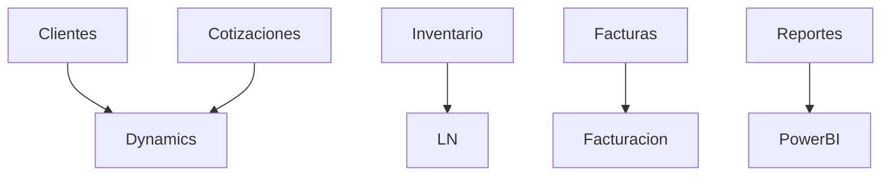

## 17. Gestión Alta/Baja de Usuarios

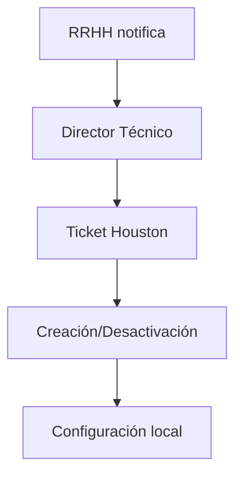

## 18. Continuidad Operativa

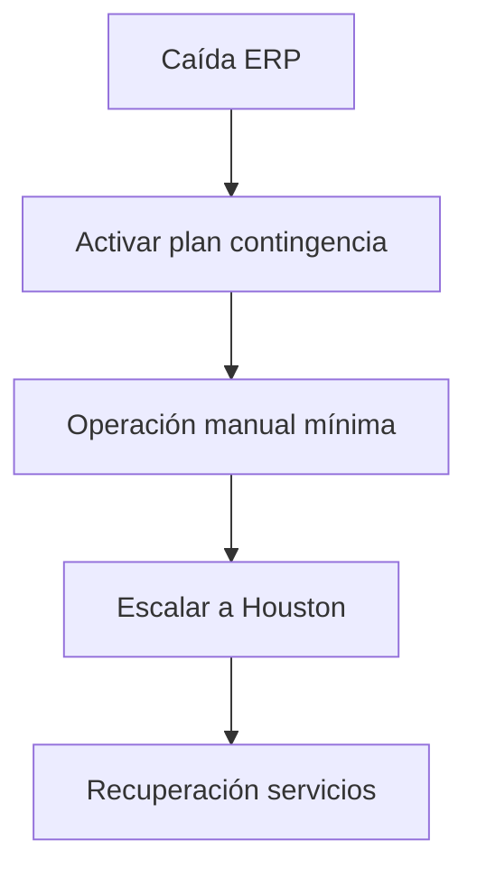

## 19. KPI Dashboard Ejecutivo

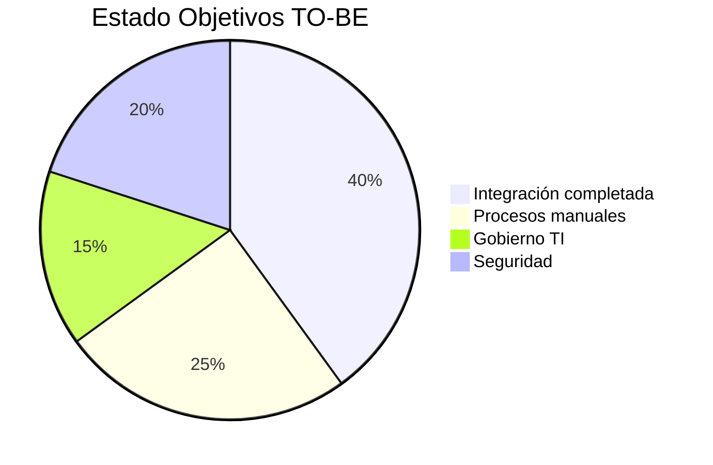

## 20. Capa Informal de Operación

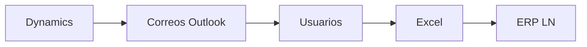


